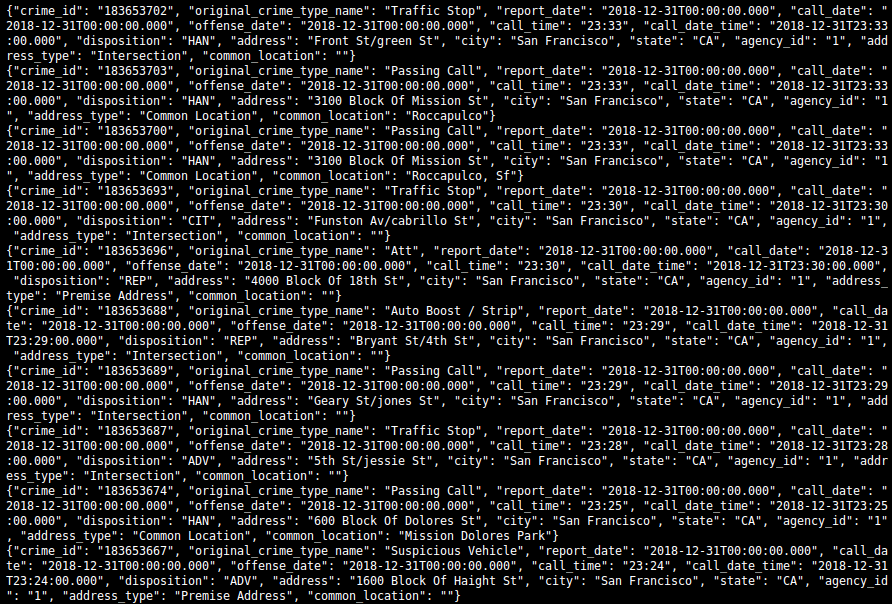
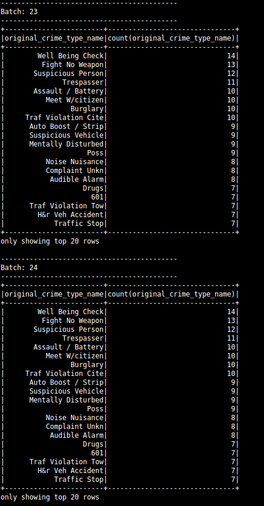
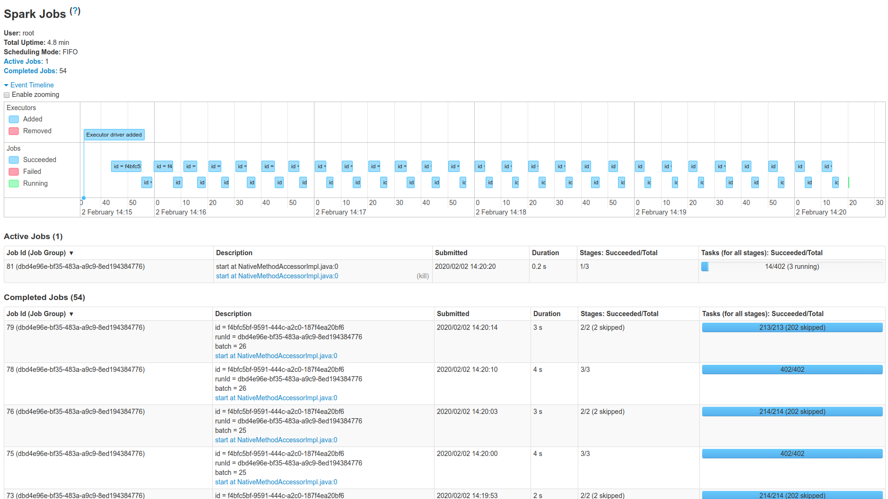

# SF Crime Statistics with Spark Streaming

## Screenshot Kafka Consumer Console Output

Inline-style: 

## Screenshot Data Stream Output

Inline-style:

## Screenshot Spark UI

## Question 1

> How did changing values on the SparkSession property parameters affect the throughput and latency of the data?

- It had a clear impact on __<code>processedRowsPerSecond</code>__.

## Question 2

> What were the 2-3 most efficient SparkSession property key/value pairs? Through testing multiple variations on values, how can you tell these were the most optimal?

- Setting __<code>spark.sql.shuffle.partitions</code>__ to 2 vs. 20, showed that the <code>processedRowsPerSecond</code> was a lot better for 2.

- Setting __<code>spark.default.parallelism</code>__ to 100 vs. 10,000, showed that the <code>processedRowsPerSecond</code> was a lot better for 100.
